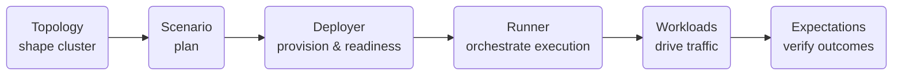

# Architecture Overview

The framework follows a clear flow: **Topology → Scenario → Deployer → Runner → Workloads → Expectations**.

## Core Flow



### Components

- **Topology** describes the cluster: how many nodes, their roles, and the high-level network and data-availability parameters they should follow.
- **Scenario** combines that topology with the activities to run and the checks to perform, forming a single plan.
- **Deployer** provisions infrastructure on the chosen backend (local processes, Docker Compose, or Kubernetes), waits for readiness, and returns a Runner.
- **Runner** orchestrates scenario execution: starts workloads, observes signals, evaluates expectations, and triggers cleanup.
- **Workloads** generate traffic and conditions that exercise the system.
- **Expectations** observe the run and judge success or failure once activity completes.

Each layer has a narrow responsibility so that cluster shape, deployment choice,
traffic generation, and health checks can evolve independently while fitting
together predictably.

## Entry Points

The framework is consumed via **runnable example binaries** in `examples/src/bin/`:

- `local_runner.rs` — Spawns nodes as local processes
- `compose_runner.rs` — Deploys via Docker Compose (requires `NOMOS_TESTNET_IMAGE` built)
- `k8s_runner.rs` — Deploys via Kubernetes Helm (requires cluster + image)

**Run with:** `POL_PROOF_DEV_MODE=true cargo run -p runner-examples --bin <name>`

**Important:** All runners require `POL_PROOF_DEV_MODE=true` to avoid expensive Groth16 proof generation that causes timeouts.

These binaries use the framework API (`ScenarioBuilder`) to construct and execute scenarios.

## Builder API

Scenarios are defined using a fluent builder pattern:

```rust
let mut plan = ScenarioBuilder::topology_with(|t| {
        t.network_star()      // Topology configuration
            .validators(3)
            .executors(2)
    })
    .wallets(50)             // Wallet seeding
    .transactions_with(|txs| {
        txs.rate(5)
            .users(20)
    })
    .da_with(|da| {
        da.channel_rate(1)
            .blob_rate(2)
    })
    .expect_consensus_liveness()  // Expectations
    .with_run_duration(Duration::from_secs(90))
    .build();
```

**Key API Points:**
- Topology uses `.topology_with(|t| { t.validators(N).executors(M) })` closure pattern
- Workloads are configured via `_with` closures (`transactions_with`, `da_with`, `chaos_with`)
- Chaos workloads require `.enable_node_control()` and a compatible runner

## Deployers

Three deployer implementations:

| Deployer | Backend | Prerequisites | Node Control |
|----------|---------|---------------|--------------|
| `LocalDeployer` | Local processes | Binaries in sibling checkout | No |
| `ComposeDeployer` | Docker Compose | `NOMOS_TESTNET_IMAGE` built | Yes |
| `K8sDeployer` | Kubernetes Helm | Cluster + image loaded | Not yet |

**Compose-specific features:**
- Includes Prometheus at `http://localhost:9090` (override via `TEST_FRAMEWORK_PROMETHEUS_PORT`)
- Optional OTLP trace/metrics endpoints (`NOMOS_OTLP_ENDPOINT`, `NOMOS_OTLP_METRICS_ENDPOINT`)
- Node control for chaos testing (restart validators/executors)

## Assets and Images

### Docker Image
Built via `testing-framework/assets/stack/scripts/build_test_image.sh`:
- Embeds KZG circuit parameters from `testing-framework/assets/stack/kzgrs_test_params/`
- Includes runner scripts: `run_nomos_node.sh`, `run_nomos_executor.sh`
- Tagged as `NOMOS_TESTNET_IMAGE` (default: `nomos-testnet:local`)

### Circuit Assets
KZG parameters required for DA workloads:
- **Default path:** `testing-framework/assets/stack/kzgrs_test_params/`
- **Override:** `NOMOS_KZGRS_PARAMS_PATH=/custom/path`
- **Fetch via:** `scripts/setup-nomos-circuits.sh v0.3.1 /tmp/circuits`

### Compose Stack
Templates and configs in `testing-framework/runners/compose/assets/`:
- `docker-compose.yml.tera` — Stack template (validators, executors, Prometheus)
- Cfgsync config: `testing-framework/assets/stack/cfgsync.yaml`
- Monitoring: `testing-framework/assets/stack/monitoring/prometheus.yml`

## Logging Architecture

**Two separate logging pipelines:**

| Component | Configuration | Output |
|-----------|--------------|--------|
| **Runner binaries** | `RUST_LOG` | Framework orchestration logs |
| **Node processes** | `NOMOS_LOG_LEVEL`, `NOMOS_LOG_FILTER`, `NOMOS_LOG_DIR` | Consensus, DA, mempool logs |

**Node logging:**
- **Local runner:** Writes to temporary directories by default (cleaned up). Set `NOMOS_TESTS_TRACING=true` + `NOMOS_LOG_DIR` for persistent files.
- **Compose runner:** Default logs to container stdout/stderr (`docker logs`). Optional per-node files if `NOMOS_LOG_DIR` is set and mounted.
- **K8s runner:** Logs to pod stdout/stderr (`kubectl logs`). Optional per-node files if `NOMOS_LOG_DIR` is set and mounted.

**File naming:** Per-node files use prefix `nomos-node-{index}` or `nomos-executor-{index}` (may include timestamps).

## Observability

**Prometheus (Compose only):**
- Exposed at `http://localhost:9090` (configurable)
- Scrapes all validator and executor metrics
- Accessible in expectations: `ctx.telemetry().prometheus_endpoint()`

**Node APIs:**
- HTTP endpoints per node for consensus info, network status, DA membership
- Accessible in expectations: `ctx.node_clients().validators().get(0)`

**OTLP (optional):**
- Trace endpoint: `NOMOS_OTLP_ENDPOINT=http://localhost:4317`
- Metrics endpoint: `NOMOS_OTLP_METRICS_ENDPOINT=http://localhost:4318`
- Disabled by default (no noise if unset)

For detailed logging configuration, see [Logging and Observability](operations.md#logging-and-observability).
